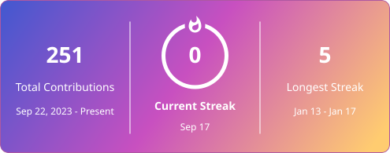

  
   
  

---

<!-- ===== INFO ===== -->
<h2 style="border-bottom: 1px solid #d8dee4; color: #282d33;">🧑‍💻 Information</h2>

Integrated MS&ndash;PhD Student @ SYSLAB(Sungkyunkwan University)

<table>
  <tr>
    <td><b>Research Interests</b></td>
    <td>
      
      
      
      
    </td>
  </tr>
  <tr>
    <td><b>Email</b></td>
    <td>
      
    </td>
  </tr>
  <tr>
    <td><b>Personal Website</b></td>
    <td>
      
    </td>
  </tr>
  <tr>
    <td><b>Affiliation</b></td>
    <td>
      
    </td>
  </tr>
</table>

---

<!-- ===== TECH STACK ===== -->
<table align="center">
<tr>
<td width="60%" valign="top">

##  Tech Stack 

### 💻 Programming Languages

### 🛠 Tools & Platforms

### 📚 In Studying ...

### 🚀 Interested in ...

</td>
<td width="40%" valign="top">

  

</td>
</tr>
</table>

---

<!-- ===== GITHUB STATS + STREAK ===== -->
<h2 style="border-bottom: 1px solid #d8dee4; color: #282d33;">✨ GitHub Status</h2>

  
  

 

  

<!-- ===== TROPHY ===== -->

  

---

<!-- ===== FOOTER ===== -->

  

